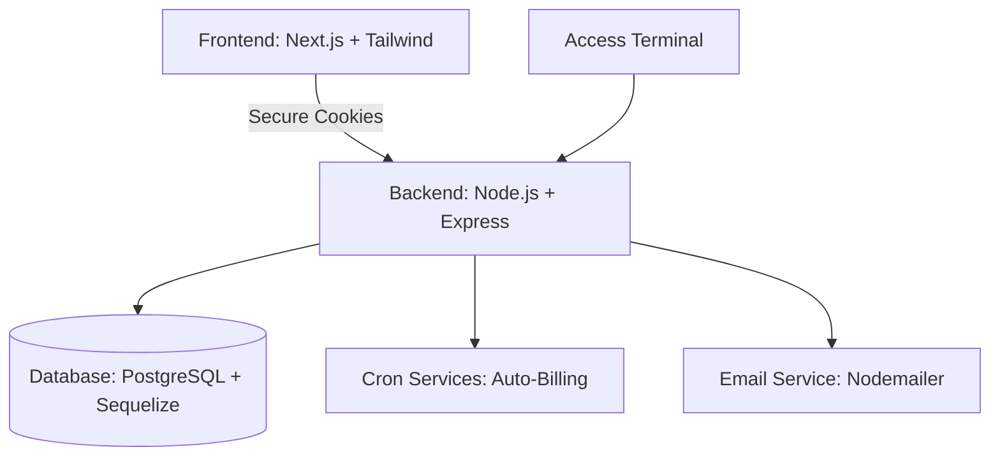

# Gym Control - Premium Fitness Management Platform 🦾🔥

**Gym Control** es una solución integral y de alta fidelidad diseñada para la gestión moderna de gimnasios. Combina un diseño premium con una arquitectura robusta para manejar alumnos, pagos, rutinas y asistencia de forma automatizada.

---

## ✨ Características Principales

### 🏢 Panel de Administración
- Gestión total de alumnos y membresías.
- **Business Intelligence**: Gráficos de crecimiento neto, mapas de calor de asistencia y control de morosidad en tiempo real.
- **Optimización Crítica**: Aceleración por GPU para efectos visuales complejos y renderizado inteligente (`content-visibility`) para alto rendimiento en listas largas.
- Generación de rutinas personalizadas con diseño premium.
- Notificaciones internas dinámicas.
- **Flujo Automatizado**: Proceso "Registro -> Cobro" integrado para agilizar la administración.

### 📱 Dashboard del Alumno
- Acceso táctil y visual a rutinas asignadas.
- Historial de asistencias y estado de membresía.
- Generación de QRs dinámicos para ingreso.

### 📍 Terminal de Acceso (Monitor)
- Terminal dedicada para la entrada al gimnasio.
- Escaneo de QR con validación en tiempo real.
- Ingreso manual por DNI.
- **Bloqueo Inteligente**: Impide el ingreso si la cuota está vencida o si el alumno intenta re-ingresar en menos de 2 minutos.

---

## 🏗️ Arquitectura del Sistema



---

## 🛠️ Tech Stack

- **Frontend**: Next.js 15+, Tailwind CSS, Framer Motion, Axios.
- **Backend**: Node.js, TypeScript, Express, Sequelize ORM.
- **Database**: PostgreSQL.
- **Seguridad**: JWT, HTTP-Only Cookies, Encriptación Bcrypt.

---

## 🚀 Instalación Rápida

Este proyecto es un monorepo compuesto por un backend y un frontend.

1.  **Clonar el repositorio**:
    ```bash
    git clone https://github.com/lucio1907/Gym-Control.git
    cd Gym-Control
    ```

2.  **Configurar el Backend**:
    - Entrar a `/backend`.
    - Instalar: `npm install`.
    - Configurar el archivo `.env` (ver [README del Backend](./backend/README.md)).
    - Iniciar: `npm run dev`.

3.  **Configurar el Frontend**:
    - Entrar a `/frontend`.
    - Instalar: `npm install`.
    - Configurar el archivo `.env.local` (ver [README del Frontend](./frontend/README.md)).
    - Iniciar: `npm run dev`.

---

## 🔒 Seguridad y Automatización

- **Protección**: Las rutas están protegidas por roles (Administrador y Usuario).
- **Billing Automation**: El sistema verifica automáticamente los vencimientos cada día y bloquea accesos en tiempo real si el pago no está al día.

Desarrollado con un enfoque en la **estabilidad** y el **diseño de alta calidad**. 🚀
